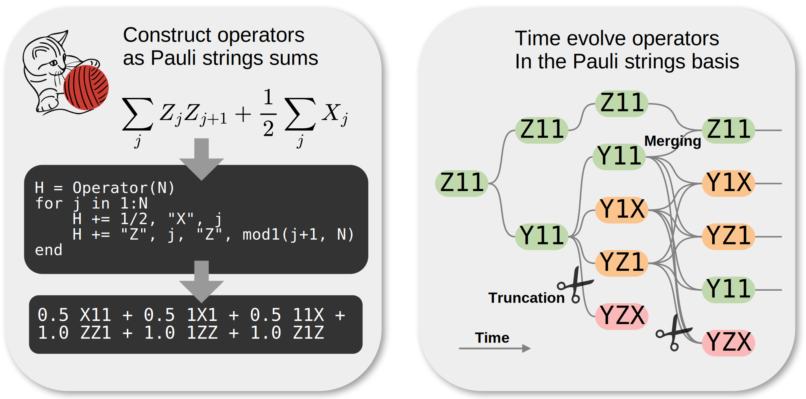
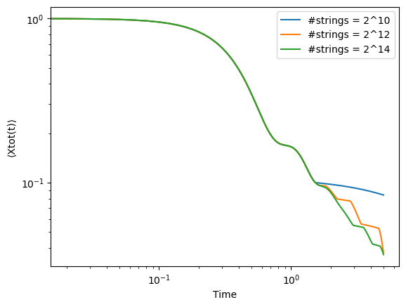
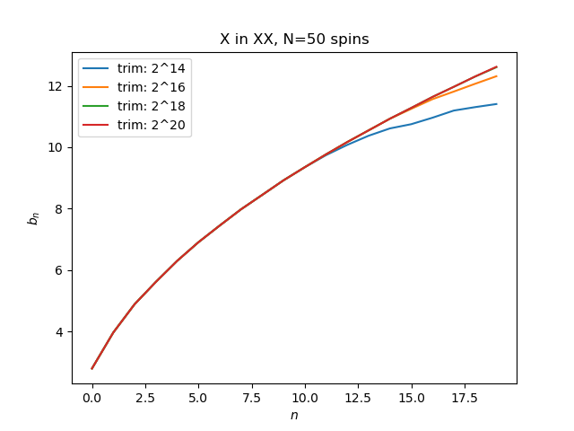

# PauliStrings.jl

[](https://github.com/nicolasloizeau/PauliStrings.jl/actions/workflows/CI.yml?query=branch%3Amain)
[](https://nicolasloizeau.github.io/PauliStrings.jl/dev)
[](https://nicolasloizeau.github.io/PauliStrings.jl/stable)
[](https://arxiv.org/abs/2410.09654)
[](https://scipost.org/SciPostPhysCodeb.54)


PauliStrings.jl is a Julia package for many-body quantum simulation with Pauli strings represented as binary integers.
It is particularly adapted for low-magic applications, efficiently manipulating local operators, time evolving noisy systems and simulating spin systems on arbitrary geometries.
Paper : [https://arxiv.org/abs/2410.09654](https://arxiv.org/abs/2410.09654),
[Python version](https://github.com/nicolasloizeau/PauliStrings.py)




## [Documentation](https://paulistrings.org/dev/)
The documentation is there : [https://paulistrings.org](https://paulistrings.org)

To build the docs :
```
julia docs/make.jl
```

## Installation
You can install the package using Julia's package manager
```julia
using Pkg; Pkg.add("PauliStrings")
```
Or
```julia
] add PauliStrings
```

## Initializing an operator

Import the library and initialize a operator of 4 qubits
```julia
import PauliStrings
H = Operator(4)
```


Add a Pauli string to the operator
```julia
H += "XYZ1"
H += "1YZY"
```
```
julia> H
(1.0 - 0.0im) XYZ1
(1.0 - 0.0im) 1YZY
```

Add a Pauli string with a coefficient
```julia
H += -1.2, "XXXZ" # coefficient can be complex
```

Add a 2-qubit string coupling qubits i and j with X and Y:
```julia
H += 2, "X", i, "Y", j # with a coefficient=2
H += "X", i, "Y", j # with a coefficient=1
```

Add a 1-qubit string:
```julia
H += 2, "Z", i # with a coefficient=2
H += "Z", i # with a coefficient=1
H += "S+", i
```

Supported sites operators are `X`, `Y`, `Z`, `Sx`=X/2, `Sy`=Y/2, `Sz`=Z/2, `S+`=(X+iY)/2, `S-`=(X-iY)/2, `Pup`=(I+Z)/2, `Pdown`=(I-Z)/2.

## Basic Algebra
The Operator type supports the +,-,* operators with other Operators and Numbers:
```julia
H3 = H1*H2
H3 = H1+H2
H3 = H1-H2
H3 = H1+2 # adding a scalar is equivalent to adding the unit times the scalar
H = 5*H # multiply operator by a scalar
```
Trace : `LinearAlgebra.tr(H)`

Frobenius norm : `LinearAlgebra.norm(H)`

Conjugate transpose : `H'`

Number of terms: `length(H)`

Commutator: `commutator(H1, H2)`. This is much faster than `H1*H2-H2*H1`


## Print and export
`print` shows a list of terms with coefficients e.g:
```julia
julia> println(H)
(10.0 - 0.0im) 1ZZ
(5.0 - 0.0im) 1Z1
(15.0 + 0.0im) XYZ
(5.0 + 0.0im) 1YY
```

Export a list of strings with coefficients:
```julia
coefs, strings = op_to_strings(H)
```

## Truncate, Cutoff, Trim, Noise
`truncate(H,M)` removes Pauli strings longer than M (returns a new Operator)
`cutoff(H,c)` removes Pauli strings with coefficient smaller than c in absolute value (returns a new Operator)
`trim(H,N)` keeps the first N trings with higest weight (returns a new Operator)

`add_noise(H,g)` adds depolarizing noise that make each strings decay like $e^{gw}$ where $w$ is the length of the string. This is useful when used with `trim` to keep the number of strings manageable during time evolution.


## Time evolution

Time evolution in the Pauli strings basis is commonly referred to as *sparse Pauli dynamics*, *Pauli paths simulation*, *Pauli propagation* or *Pauli backpropagation*.

The main entry point is `evolve(H, O, tspan; method, fout, dissipation, truncation)`, which integrates `O` in the Heisenberg picture and saves the value of `fout(O)` at every time in `tspan`. Available integrators are `RK4()`, `DOPRI5()`, `Trotter()`, and `Exact()`.

Each save step performs (1) one integrator step, (2) an optional `dissipation` step (typically depolarizing noise via `add_noise`), and (3) an optional `truncation` step (typically `trim`). The combination of noise and truncation is what makes long-time simulations tractable.

Below we evolve $Z_1$ in a chaotic spin chain and record the autocorrelator $S(t) = \tfrac{1}{2^N}\textup{Tr}\big[Z_1(0) Z_1(t)\big]$ for several truncation levels:

```julia
using PauliStrings

function chaotic_chain(N::Int)
    H = Operator(N)
    for j in 1:N
        H += "X", j, "X", mod1(j+1, N)
    end
    for j in 1:N
        H += -1.05, "Z", j
        H +=  0.5,  "X", j
    end
    return H
end

N = 32
H  = chaotic_chain(N)
O0 = Operator(N) + ("Z", 1)
dt = 0.02
times = 0:dt:5

dissipation(O, dt) = add_noise(O, 0.05 * dt)
fout(O) = real(trace_product(O0, O) / 2^N)

for M in [10, 12, 14]
    truncation(o) = trim(o, 2^M)
    res = evolve(H, O0, times;
                 method=RK4(), fout=fout,
                 dissipation=dissipation, truncation=truncation)
    # plot times vs res.history
end
```

A runnable version is in `examples/evolve_chaotic.jl` (and `examples/evolve_tfim.jl`). See the [time evolution tutorial](https://nicolasloizeau.github.io/PauliStrings.jl/dev/evolution/) for a walkthrough.



## Lanczos
Compute lanczos coefficients
```julia
bs = lanczos(H, O, steps, nterms)
```
`H` : Hamiltonian

`O` : starting operator

`nterms` : maximum number of terms in the operator. Used by trim at every step

Results for X in XX from https://journals.aps.org/prx/pdf/10.1103/PhysRevX.9.041017 :




## Circuits
The module `Circuits` provides an easy way to construct and simulate circuits.
Construct a Toffoli gate out elementary gates:


```julia
using PauliStrings
using PauliStrings.Circuits

function noisy_toffoli()
    c = Circuit(3)
    push!(c, "H", 3)
    push!(c, "CNOT", 2, 3); push!(c, "Noise")
    push!(c, "Tdg", 3)
    push!(c, "CNOT", 1, 3); push!(c, "Noise")
    push!(c, "T", 3)
    push!(c, "CNOT", 2, 3); push!(c, "Noise")
    push!(c, "Tdg", 3)
    push!(c, "CNOT", 1, 3); push!(c, "Noise")
    push!(c, "T", 2)
    push!(c, "T", 3)
    push!(c, "CNOT", 1, 2); push!(c, "Noise")
    push!(c, "H", 3)
    push!(c, "T", 1)
    push!(c, "Tdg", 2)
    push!(c, "CNOT", 1, 2); push!(c, "Noise")
    return c
end
```


Compute the expectation value $<110|U|111>$:
```julia
c = noisy_toffoli()
expect(c, "111", "110")
```

## Contributing, Contact
Contributions are welcome! Feel free to open a pull request if you'd like to contribute code or documentation.
For bugs and feature requests, please [open an issue](https://github.com/nicolasloizeau/PauliStrings.jl/issues).
For questions, you can either contact `nicolas.loizeau@nbi.ku.dk` or start a new [discussion](https://github.com/nicolasloizeau/PauliStrings.jl/discussions) in the repository.


## Citation
```
@Article{Loizeau2025,
	title={{Quantum many-body simulations with PauliStrings.jl}},
	author={Nicolas Loizeau and J. Clayton Peacock and Dries Sels},
	journal={SciPost Phys. Codebases},
	pages={54},
	year={2025},
	publisher={SciPost},
	doi={10.21468/SciPostPhysCodeb.54},
	url={https://scipost.org/10.21468/SciPostPhysCodeb.54},
}

@Article{Loizeau2025,
	title={{Codebase release 1.5 for PauliStrings.jl}},
	author={Nicolas Loizeau and J. Clayton Peacock and Dries Sels},
	journal={SciPost Phys. Codebases},
	pages={54-r1.5},
	year={2025},
	publisher={SciPost},
	doi={10.21468/SciPostPhysCodeb.54-r1.5},
	url={https://scipost.org/10.21468/SciPostPhysCodeb.54-r1.5},
}
```
