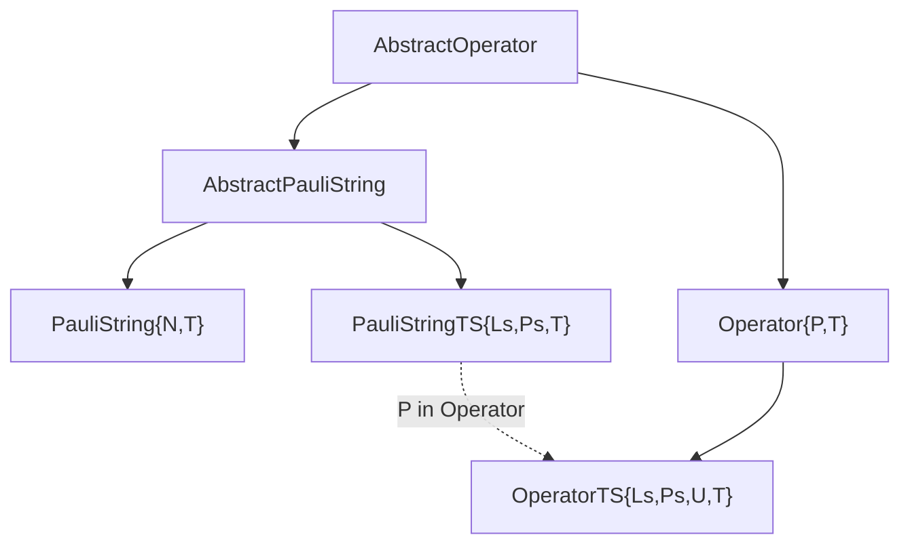

# Advanced usage and data structures

This page is for power users and contributors who want to understand how PauliStrings.jl represents and manipulates Pauli strings at the bit level. Most users can stay with [`Operator`](@ref), [`PauliString`](@ref), and the high-level `+=` API; read on when writing performance-sensitive code or extending the library.

For a gentler introduction to single strings, see [Manipulating single strings](@ref). The encoding follows [Quantum many-body simulations with PauliStrings.jl](https://arxiv.org/abs/2410.09654) and [Phys. Rev. A **68**, 042318 (2003)](https://journals.aps.org/pra/abstract/10.1103/PhysRevA.68.042318).

## Binary encoding

Each [`PauliString{N,T}`](@ref) stores a length-``N`` Pauli string as two unsigned integers ``(v, w)``:

```julia
struct PauliString{N,T<:Unsigned} <: AbstractPauliString
    v::T   # Z/Y component
    w::T   # X/Y component
end
```

Site ``i`` is encoded in bit ``i - 1`` of both integers (least significant bit = site 1; printed strings show site 1 on the left). Binary literals therefore read **right-to-left** with respect to site order.

| Pauli | ``v_i`` | ``w_i`` |
|-------|---------|---------|
| ``I`` or `1` | 0 | 0 |
| ``X`` | 0 | 1 |
| ``Z`` | 1 | 0 |
| ``Y`` | 1 | 1 |

The encoding uses ``X^2 = Z^2 = Y^2 = \mathbb{1}`` and ``XZ = iY``.

```@example advanced
using PauliStrings
s = PauliString("Y1Z1")   # Y at site 1, Z at site 3
(s.v, s.w)                  # v = 0b0101 = 5, w = 0b0001 = 1
PauliString{4}(s.v, s.w)    # round-trip
```

### Bit predicates

Common string statistics are single bitwise operations ([`xcount`](@ref), [`ycount`](@ref), [`zcount`](@ref), [`pauli_weight`](@ref)):

| Quantity | Bit expression |
|----------|----------------|
| X count | `count_ones(~p.v & p.w)` |
| Y count | `count_ones(p.v & p.w)` |
| Z count | `count_ones(p.v & ~p.w)` |
| Pauli weight | `count_ones(p.v \| p.w)` |

```@example advanced
using PauliStrings
p = PauliString("X1YZ")
(xcount(p), ycount(p), zcount(p), pauli_weight(p))
```

### Converting representations

[`string_to_vw`](@ref) and [`vw_to_string`](@ref) convert between character strings and ``(v, w)``. Decoding accumulates a Y-phase because each ``Y`` contributes a factor of ``i``:

```@example advanced
using PauliStrings
v, w = string_to_vw("Y1Z1")
vw_to_string(v, w, 4)
```

The two integers can also be packed: `unsigned(p::PauliString)` returns ``v \ll N + w``.

## Integer types and size limits

The integer type ``T`` is part of the concrete string type and is selected by `PauliStrings.uinttype(N)` (via [`paulistringtype(N)`](@ref)):

```@example advanced
using PauliStrings
typeof(PauliString("XYZ1"))
paulistringtype(8)
paulistringtype(64)
paulistringtype(128)
paulistringtype(256)
```

The backing width is the smallest power of two ``\ge N`` (with a special case ``N \le 8 \Rightarrow`` `UInt8`):

| ``N`` (qubits) | Integer type ``T`` |
|----------------|-------------------|
| ``N \le 8`` | `UInt8` |
| ``9 \le N \le 16`` | `UInt16` |
| ``17 \le N \le 32`` | `UInt32` |
| ``33 \le N \le 64`` | `UInt64` |
| ``65 \le N \le 128`` | `UInt128` |
| ``129 \le N \le 256`` | `UInt256` |
| … | `UInt512`, `UInt1024`, … |

For ``N > 1024``, a custom `UInt` type is generated at runtime via [BitIntegers.jl](https://github.com/kalmarek/BitIntegers.jl). The package supports up to 1024 qubits out of the box.

```@example advanced
using PauliStrings
for N in [4, 20, 100, 200]
    T = PauliStrings.uinttype(N)
    println("N = $N  →  $T  ($(sizeof(T)*8) bits)")
end
P = paulistringtype(64)
P("X" * "1"^63)
```

## Phase storage and coefficients

PauliStrings.jl uses **real** Pauli matrices ``\{I, X, Y, Z\}`` (``Y`` Hermitian). The identity ``Y = i X Z`` is reflected in storage.

### Single strings

For a [`PauliString`](@ref), the [`AbstractOperator`](@ref) interface exposes the Y-phase via [`ycount`](@ref):

```@example advanced
using PauliStrings
p = PauliString("1Y1")
ycount(p), values(p)   # values(p) == ((1.0im)^ycount(p),)
```

Each ``Y`` contributes ``(i)^k``:

| ``ycount`` | Phase ``(i)^y`` |
|------------|-----------------|
| 0 | ``+1`` |
| 1 | ``+i`` |
| 2 | ``-1`` |
| 3 | ``-i`` |

### Operators: `O.coeffs` vs [`get_coeffs(O)`](@ref)

An [`Operator`](@ref) stores parallel vectors `strings` and `coeffs`. The **printed** coefficient differs from the **stored** one:

```math
\texttt{o.coeffs[i]} = \text{public\_coeff}_i \times (i)^{\mathrm{ycount}(p_i)}
```

```@example advanced
using PauliStrings
O = Operator("Y")
O.coeffs
get_coeffs(O)
```

```@example advanced
using PauliStrings
o = Operator(4)
o += 2, "1XXY"
o += 3, "11Z1"
o.coeffs        # internal storage, Y phase included
get_coeffs(o)   # user-facing coefficients
```

[`get_coeffs`](@ref), [`get_coeff`](@ref), and [`op_to_strings`](@ref) divide out the Y-phase. Prefer them over reading `o.coeffs` unless you implement low-level kernels — keeping the phase in `coeffs` avoids recomputing it at every multiplication.

`getindex(o, i)` returns `(displayed_coeff, string)` by dividing out the Y-phase. `pairs(o)`, `keys(o)`, and `values(o)` use **stored** coefficients instead — prefer [`get_coeffs`](@ref) for user-facing values. When adding terms via `H += c, "Y", i`, the package stores `c * (1im)^ycount`. The same convention applies to `push!(o, c, v, w)`.

## Pauli algebra as boolean algebra

Pauli multiplication reduces to **bitwise XOR** on ``(v, w)`` plus a small integer phase. The low-level kernels live in `operations.jl`.

### Multiplication

For two strings of the same type:

```julia
p = p1 ⊻ p2    # v = v1 ⊻ v2,  w = w1 ⊻ w2
p, k = PauliStrings.prod(p1, p2)
# k = 1 - ((count_ones(p1.v & p2.w) & 1) << 1)   ∈ {1, -1}
```

Each qubit where the left operand has ``Z`` (`v=1`) and the right has ``X`` (`w=1`) contributes a factor of ``-1``; the total ``k`` is the product of these signs.

```@example advanced
using PauliStrings
x = PauliString("X")
z = PauliString("Z")
x ⊻ z                              # Y at bit level
p, k = PauliStrings.prod(x, z)
(p, k, ycount(p))
Operator(x) * Operator(z)          # full phase from coeffs + k + ycount
```

### Commutation

```julia
p, k = commutator(p1, p2)      # k ∈ {-2, 0, 2}
p, k = anticommutator(p1, p2)  # k ∈ {0, 2}
```

```@example advanced
using PauliStrings
x, z, y = PauliString("X"), PauliString("Z"), PauliString("Y")
commutator(x, z)               # (Y, 2) at string level
commutator(x, y)               # anticommute → vanishes
commutator(x, x)               # identical → vanishes
commutator(Operator("X"), Operator("Z"))
```

For full [`Operator`](@ref) products and commutators, the internal `binary_kernel` applies `PauliStrings.prod` (or [`commutator`](@ref) / [`anticommutator`](@ref)) to every pair of terms, accumulates coefficients (including Y-phases from `values(o)`), and merges duplicates via [`compress`](@ref). This is much faster than forming `A * B - B * A` explicitly.

**Mental model:**

- XOR decides the output Pauli label.
- `count_ones` parity on ``p_1.v \wedge p_2.w`` (and the symmetric term for commutators) decides signs.
- `ycount` and `O.coeffs` carry the ``i`` phases needed for printed coefficients.

## Type hierarchy



```text
AbstractOperator
├── AbstractPauliString
│   ├── PauliString{N,T}
│   └── PauliStringTS{Ls,Ps,T}
└── Operator{P,T}
    └── OperatorTS{Ls,Ps,U,T} = Operator{PauliStringTS{Ls,Ps,U},T}
```

| Type | Role | Storage | When to use |
|------|------|---------|-------------|
| [`AbstractOperator`](@ref) | Common interface | — | Generic `+`, `*`, [`commutator`](@ref), [`evolve`](@ref), … |
| [`AbstractPauliString`](@ref) | Single string | — | One-term objects, length 1 |
| [`PauliString{N,T}`](@ref) | Concrete string on ``N`` sites | `v::T`, `w::T` | Hot loops, direct bit access |
| [`Operator{P,T}`](@ref) | Sum of strings | `strings`, `coeffs` | Hamiltonians, observables |
| [`PauliStringTS{Ls,Ps,T}`](@ref) | Translation orbit (one rep.) | `v::T`, `w::T` | One pattern summed over shifts |
| [`OperatorTS{Ls,Ps,U,T}`](@ref) | Translation-symmetric sum | Same as `Operator` | Periodic lattices; see [Translation symmetry](@ref) |

| Type | Example |
|------|---------|
| `PauliString{N,T}` | `PauliString("XYYZ")` |
| `Operator{P,T}` | `H = ising1D(20, -1, 1)` |
| `PauliStringTS{Ls,Ps,T}` | `PauliStringTS{(4,)}("XX11")` |
| `OperatorTS{Ls,Ps,U,T}` | `OperatorTS{(30,)}(H_full)` |

Generic code can query types without field access: [`paulistringtype`](@ref), [`qubitlength`](@ref), `scalartype`, [`qubitsize`](@ref), [`periodicflags`](@ref).

```@example advanced
using PauliStrings
p = PauliString{4}("X1Z1")
qubitlength(p), paulistringtype(p)
O = Operator(8) + "XZZ1XXXX"
scalartype(O), paulistringtype(O)
Hts = OperatorTS{(4,)}(Operator(4) + "X1Z1")
qubitsize(Hts), periodicflags(Hts)
```

### [`PauliString{N,T}`](@ref)

- ``N``: qubits (compile-time constant); ``T``: bit width (see table above).
- `p[i]` returns `:X`, `:Y`, `:Z`, or `Symbol(1)`.
- `keys(p) = (p,)`, `values(p) = ((1im)^ycount(p),)`.
- Strings are ordered by lexicographic comparison on ``(v, w)``; for `UInt32`/`UInt64` strings, hashing uses a Fibonacci mix of ``v`` and ``w``.

```@example advanced
using PauliStrings
p = PauliString("X1YZ")
support(p), pauli_weight(p)
```

### [`Operator{P,T}`](@ref)

- ``P``: string type; ``T``: coefficient type (default `ComplexF64`).
- Repeated strings merged by [`compress`](@ref).
- `keys(o)`, `values(o)`, `pairs(o)` iterate `(string, stored_coeff)`.

```@example advanced
using PauliStrings
H = Operator(4)
H += "X", 1, "X", 2
H += -1.05, "Z", 1
H
```

### [`PauliStringTS{Ls,Ps,T}`](@ref)

- ``Ls``: lattice shape, e.g. `(L,)` or `(Lx, Ly)`; ``Ps``: periodic flags per dimension.
- Stores the **canonical representative** (maximum string under allowed translations; `find_representative` in `translation_symmetry.jl`).
- Multiplication against another TS string sums over all shifts of the second representative.

```@example advanced
using PauliStrings
p = PauliStringTS{(4,)}("X1Y1")
qubitsize(p), periodicflags(p), representative(p)
```

### [`OperatorTS{Ls,Ps,U,T}`](@ref)

Type alias for `Operator{PauliStringTS{Ls, Ps, U}, T}`.

- Built with [`OperatorTS{Ls}(o::Operator)`](@ref) or [`OperatorTS1D`](@ref) / [`OperatorTS2D`](@ref).
- [`representative(o)`](@ref): stored canonical terms as an [`Operator`](@ref).
- [`resum(o)`](@ref): expand the lazy translation sum into a dense [`Operator`](@ref).

```@example advanced
using PauliStrings
H0 = Operator(4)
H0 += "X", 1, "X", 2
H = OperatorTS1D(H0; full=false)
representative(H)
```

### Storage conventions

| Field | Format | Notes |
|-------|--------|-------|
| Single string | `(v, w)` unsigned integers | Two bits per qubit |
| Coefficient | `public_coeff × (i)^ycount` in `coeffs[i]` | Y phase embedded |
| TS representative | `(v, w)` of max shift | Lazy sum over translations |
| Identity | `v = 0, w = 0` | All sites trivial |

## Practical guidance

- Use public constructors and [`get_coeffs`](@ref) unless you need the internal representation.
- If you read `O.coeffs` directly, remember Y phases are already folded in.
- Prefer [`PauliString`](@ref) for individual strings, [`Operator`](@ref) for sums.
- Prefer [`OperatorTS`](@ref) / [`OperatorTS1D`](@ref) when translation symmetry is part of the object.
- When extending algebra: XOR for the output support, parity checks for signs, [`compress`](@ref) or `setwith!` to accumulate terms.
