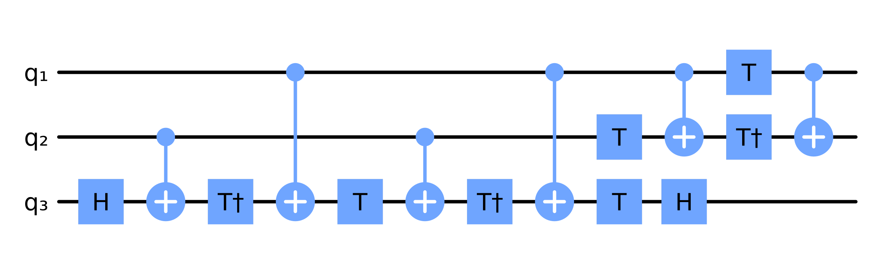

# Quantum circuits

The module `Circuits` provides a way to construct and simulate circuits.
Initialise an empty circuit with `Circuit(n)` where `n` is the number of qubits.
Then, add gates to the circuit with `push!(circuit, gate, qubits...)` where `gate` is a string representing the gate and `qubits` are the qubits the gate acts on.
For example, a CNOT gate with control qubit 1 and target qubit 2 is added to the circuit `c` with `push!(c, "CNOT", 1, 2)`.
Depolarizing noise can be added to the circuit with `push!(c, "Noise")`. The noise amplitude can be set with `c.noise_amplitude=p`.


Lets construct a CCX gate (Toffoli gate) out of CNOT and single qubit gates.


```@example circuits
using PauliStrings
using PauliStrings.Circuits

function noisy_toffoli()
    c = Circuit(3)
    push!(c, "H", 3)
    push!(c, "CNOT", 2, 3); push!(c, "Noise")
    push!(c, "Tdg", 3)
    push!(c, "CNOT", 1, 3); push!(c, "Noise")
    push!(c, "T", 3)
    push!(c, "CNOT", 2, 3); push!(c, "Noise")
    push!(c, "Tdg", 3)
    push!(c, "CNOT", 1, 3); push!(c, "Noise")
    push!(c, "T", 2)
    push!(c, "T", 3)
    push!(c, "CNOT", 1, 2); push!(c, "Noise")
    push!(c, "H", 3)
    push!(c, "T", 1)
    push!(c, "Tdg", 2)
    push!(c, "CNOT", 1, 2); push!(c, "Noise")
    return c
end
```

We can plot the circuit using [QuantumCircuitDraw.jl](https://github.com/nicolasloizeau/QuantumCircuitDraw.jl):
```julia
using QuantumCircuitDraw
c = noisy_toffoli()
paulistrings_plot(c)
```




The circuit can be compiled to a unitary matrix with `compile(c)`.
Before compiling, set `c.noise_amplitude` to the desired noise amplitude and `c.max_strings` to the number of strings to keep at each step.
Compile will multiply the gates in the circuit from left to right, apply the noise using [`add_noise`](@ref) and trim the operator at each step using [`trim`](@ref).

Lets check our Toffoli gate against the built-in `CCX` gate in `Circuits`:

```@example circuits
using PauliStrings.Circuits
using LinearAlgebra: norm
c = noisy_toffoli()
c.noise_amplitude = 0
U1 = compile(c)
U2 = CCXGate(3,1,2,3)
println(norm(U1-U2))
```

We can also compute expectation values of states in the computational basis with `expect(c, state_out)` and `expect(c, state_in, state_out)` .
Let's compute the expectation values of the output states of the Toffoli gate when the input state is $|111\rangle$:
```@example circuits
in_state = "111"
out_states = ["000", "001", "010", "011", "100", "101", "110", "111"]
p = [real(expect(c, in_state, out_state)) for out_state in out_states]
using Plots
bar(out_states, p, legend=false, xlabel="out state", ylabel="<out|U|in>")
```

Same as above but seting the noise amplitude to 0.05:
```@example circuits
c.noise_amplitude = 0.05
p = [real(expect(c, in_state, out_state)) for out_state in out_states]
bar(out_states, p, legend=false, xlabel="out state", ylabel="<out|U|in>")
```

## Importing OpenQASM circuits

[OpenQASM](https://openqasm.com) is a standard text format for quantum circuits, so
supporting it lets you pull circuits straight from benchmark suites like
[QASMBench](https://github.com/pnnl/QASMBench). Load OpenQASM 2.0 into a [`Circuit`](@ref)
with [`parse_qasm`](@ref) (from a string) or [`load_qasm`](@ref) (from a file). This wraps
[OpenQASM.jl](https://github.com/QuantumBFS/OpenQASM.jl) for the parsing, so it becomes
available once you also load that package.

The common `qelib1.inc` gates are mapped onto the existing `Circuit` gates. Multiple
`qreg` declarations are concatenated into a single register in declaration order, and
`measure`/`barrier` statements are ignored so the imported circuit is a pure unitary.

Here we load the two-qubit Deutsch circuit from QASMBench and run it like any other
`Circuit`:

```@example qasm
using PauliStrings
using PauliStrings.Circuits
using OpenQASM

source = """
OPENQASM 2.0;
include "qelib1.inc";
qreg q[2];
creg c[2];
x q[1];
h q[0];
h q[1];
cx q[0],q[1];
h q[0];
measure q[0] -> c[0];
measure q[1] -> c[1];
"""

c = parse_qasm(source)
println(c.gates)
```

The result is an ordinary `Circuit`, so `compile`, `expect` and the rest work as usual:

```@example qasm
expect(c, "00", "11")
```
